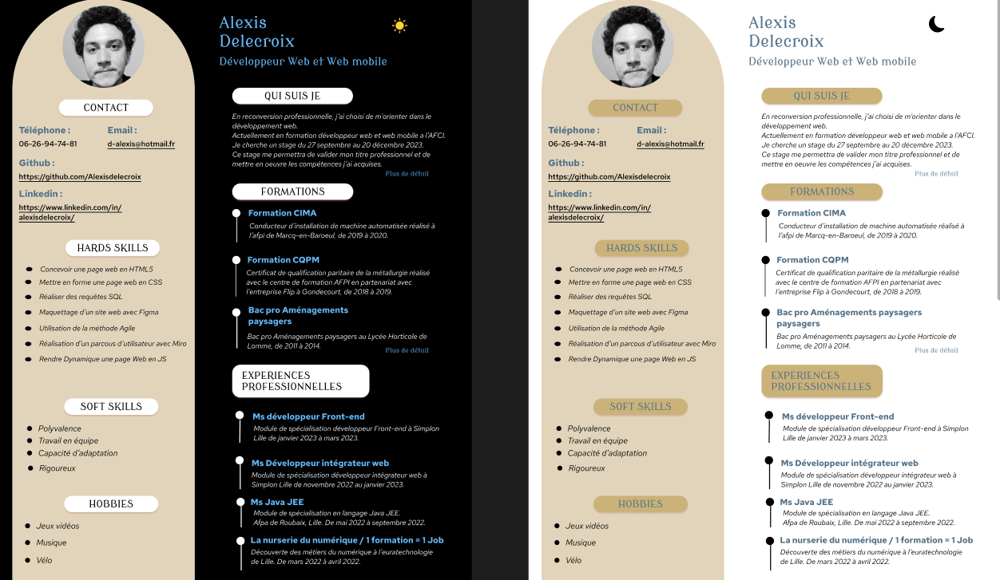

<h1 align="center"> # Cv en ligne.</h1>

## Contexte du projet 
Je cherche à recruter un développeur web pour différents projets.

J'ai besoin de votre CV en version numérique que je pourrais consulter sur mon PC mais aussi sur tablette et mobile pour le montrer à mon directeur.

 
  
  
  
  

  
  ## Performances de mon cv en ligne
  
  

  
  
  

  
## Mon objectif: 

<ul>
<li>Création de la charte graphique</li>
<li>Établir la maquette</li>
<li>Développer le site web en épousant au mieux la maquette</li>
<li>Optimisé la version mobile</li>
<li>Création d'un mode Dark</li>
<li>Analysez les problèmes de performances et les résoudres</li>
</ul>

### Structure de mon Cv en ligne:

<ul>
<li>Version pour ordinateur, tablette et téléphone portable </li>
<li>Aside sur le côté en format tablette, et mobile</li>
<li>Mode Dark disponible pour l'utilisateur</li>
<li>Création du popup pour plus de détail</li>
<li>Cv mis en ligne grâce en github pages</li>
</ul>

### Resources utlisées: 

<ul>
<li>Font awesome pour les icones</li>
<li>Figma pour la maquette et Wireframe</li>
<li>GoogleFonts pour les polices</li>
<li>Github</li>
</ul>

### Langages Utilisés

* [![HTML5][html.com]][html-url]
* [![CSS3][css.com]][css-url]
* [![JS][js.com]][js-url]

[html.com]: https://img.shields.io/badge/html5-%23E34F26.svg?style=for-the-badge&logo=html5&logoColor=white
[html-url]: https://html.com/
[css.com]: https://img.shields.io/badge/css3-%231572B6.svg?style=for-the-badge&logo=css3&logoColor=white
[css-url]: https://www.w3.org/Style/CSS/
[react.com]: https://img.shields.io/badge/React-20232A?style=for-the-badge&logo=react&logoColor=61DAFB
[react-url]: https://fr.reactjs.org/
[js.com]: https://img.shields.io/badge/JavaScript-323330?style=for-the-badge&logo=javascript&logoColor=F7DF1E
[js-url]: https://developer.mozilla.org/fr/docs/Web/JavaScript
[sass.com]: https://img.shields.io/badge/SASS-hotpink.svg?style=for-the-badge&logo=SASS&logoColor=white
[sass-url]: https://sass-lang.com/
